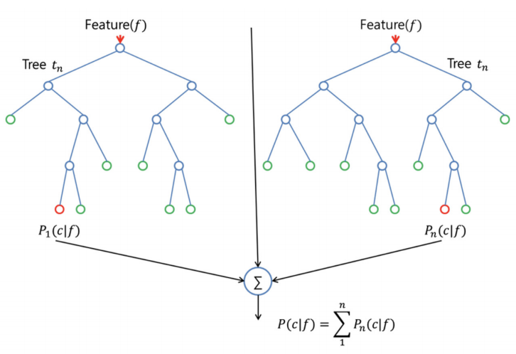

# Learning From Data - Term Project 2018

## Prediction of Shipment Return on Online Shopping

Referenced paper [Prediction of Shipment Return on Online Shopping - Ismail Bilgen, Ömer Sinan Saraç](https://ieeexplore.ieee.org/document/7130411/)

Kaggle competition [BLG 454E Term Project Competition](https://www.kaggle.com/c/blg-454e-term-project-competition) Our group is the 2nd one.

### General Info

You can find our report in both Latex and PDF formats under the [report](report/) directory.

[Source File](src/) includes the main code files we used to analyze given data set.

[Tenserflow](tenserflow/) has some other implementations we tried during the project development.

Since program is direct implementation of the referenced paper, it will only work for the data which has the same properties as the ones given under [data](data/) directory.

Following table which can also be found in report shows general information about the train set given to us.

| Feature  Names | Data Type | Data  Context             | Missing  Value  Count |
|----------------|-----------|---------------------------|-----------------------|
| orderItemID    | integer   | 1 2 3 4 5 6 7...          | 0                     |
| orderDate      | string    | "2012-04-01"...           | 0                     |
| deliveryDate   | string    | "1990-12-31"...           | 39419                 |
| itemID         | integer   | 186 71 71 ....            | 0                     |
| size           | string    | "1", "10", "10+"....      | 0                     |
| color          | string    | "almond","amethyst",..    | 143                   |
| manufacturerID | integer   | 25 21 21 14 53 87 1 3 ... | 0                     |
| price          | float     | 69.9 70 70 39.9 ...       | 0                     |
| customerID     | integer   | 794 794 794 ....          | 0                     |
| salutation     | string    | "Company", "Family" ...   | 0                     |
| dateOfBirth    | string    | "1655-04-19", ....        | 48889                 |
| state          | string    | "Baden-Wuerttemberg",..   | 0                     |
| creationDate   | string    | "2011-02-16", ....        | 0                     |
| returnShipment | integer   | "0", "1"                  | 0                     |

Our final implementation uses [RandomForestClassifier](http://scikit-learn.org/stable/modules/generated/sklearn.ensemble.RandomForestClassifier.html), however all other classifiers we tested on can be seen within commented section at the and of main.py file. Following image represents the RandomForest.

